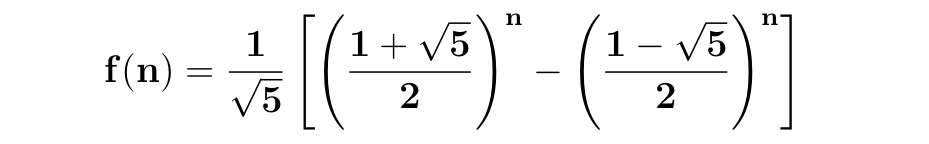

## Exercicio 02
#### [Algoritmo](../algoritmos/python/exercicio02.py)

Implementar Fibonacci nas formas recursiva, iterativa e matematica  
1 - Demonstre de forma matematica nas 3 complexidades
2 - Demonstre atraves da avaliacao de tempo/tamanho da emtrada a complexidade de cada uma das 3 implementações  
3 - Qual das 3 implementações é mais rapida?  
Formula matematica  



2)
```
Complexidade  
    Matematico  - O(1)  
    Iterativo   - O(n)  
    Recursivo   - O(2^n)  
```
