# ATIVIDADE PRÁTICA nº 03

#### Wesley Adriann - 1822130040


## FILTROS E APLICAÇÕES

### Filtro de Mediana e Ruído Sal & Pimenta

#### Ruído Sal & Pimenta
O Sal & Pimenta consiste é ruído do tipo impulsivo, onde dois níveis distintos de frequência degradam a imagem. No caso essa frequência se apresenta como pontos brancos e pretos na imagem.

#### Filtro de Mediana
O filtro de mediana, consiste em fazer a varredura pela imagem, onde é definido uma janela de pixeis a serem analisados, assim pixel a pixel e analisado ele e os vizinhos de acordo com a janela, e pegando a mediana dos valores e inserindo no local do pixel atual. Devivo a esse processo valores extremos, que é o caso do ruído sal e pimenta, tendem a ser eliminados da imagem apos a aplicação do filtro.


#### Filtro de Média
O filtro de média, segue o mesmo princípio da varredura do filtro de mediana, porem aqui, aplicamos a média da janela estabelecida. Assim, pode também solucionar o problema de imagens com ruído de sal e pimenta, porem dependo da proporção do ruído, ele pode pesar muito ao efetuar a média, e acabar fazendo alterações na cor da imagem.

#### Algoritmo

```m
% -----
% Parte 1
% Filtro de media e mediana
% -----

pkg load image

"parte 1 iniciada"
imagem_original = imread('./imagem_base.jpg');

ruido = 0.05;

imagem_base = double(rgb2gray(imagem_original))/255;
imagem_ruidosa = imnoise(imagem_base,  'salt & pepper', ruido);

ordem = 3;

"media"
mascara_media = ones(ordem, ordem);
mascara_media = mascara_media.*(1/(ordem*ordem));

imagem_media = conv2(imagem_ruidosa, mascara_media, 'same');

"mediana"
imagem_mediana = filtro_mediana(imagem_ruidosa, ordem);

"snr"
snr_conv2 = snr(imagem_base, imagem_media)
snr_mediana = snr(imagem_base, imagem_mediana)
```

Aqui temos o algoritmo principal, onde é feito o carregamento da imagem, juntamente com a conversão para escala de cinza e a aplicação do filtro sal & pimenta. É definito pela variável 'ruido', a porcentagem de ruido sal e pimenta que será aplicada na imagem, e também definito o tamanho da janela pela variável 'ordem'.  

Para o filtro de média, foi utilizada a função nativa do octave, 'conv2' passando a mascara de acordo com oque é definito na variável 'ordem'. E para o filtro de mediana foi construído um algoritmo para fazer a aplicação.

```m
function nova_imagem = filtro_mediana(imagem, ordem)

    [largura_imagem, altura_imagem] = size(imagem);
    imagem_mediana = zeros(largura_imagem, altura_imagem);

    for linha = 1:altura_imagem
        for coluna = 1:largura_imagem
            sub_matriz_ordem = sub_matriz(imagem, linha, coluna, ordem);
            mediana = median(sub_matriz_ordem(:));
            imagem_mediana(linha, coluna) = mediana;
        end
    end
    "filtro de mediana completo"

nova_imagem = imagem_mediana;
``` 

Aqui é feito a iteração pelos pixeis da imagem e calculada a mediana. Também foi desenvolvido uma função auxiliar para pegar os vizinhos do pixel atual de acordo com a variável 'ordem' definido no início


```m
function sub = sub_matriz(imagem, linha, coluna, ordem)
    matriz = zeros(ordem, ordem);
    range_vizinho = fix(ordem/2);
    i = 0;
    for linha_i = (linha-range_vizinho):(linha+range_vizinho)
        i++;
        j = 0;
        for coluna_j = (coluna-range_vizinho):(coluna+range_vizinho)
            j++;
            try
                matriz(i,j) = imagem(linha_i,coluna_j);
            catch
            end
        end
    end
sub = matriz;
```
Para evitar que o laço de repetição pare onde os vizinhos do pixel ultrapassa os limites da matriz, foi inserido um bloco de try catch, assim não tendo a necessidade de inicialmente ampliar o tamanho da imagem original para evitar o problema.  

E por fim temos a função para calcular o ganho de SNR da imagem


```m
function snr_resultado = snr(imagem_perfeita, imagem_ruidosa)
    [largura, altura] = size(imagem_perfeita);

    erro_relativo = 0;
    a = 0;
    b = 0;
    for linha = 1:altura
        for coluna = 1:largura
            a = a + power(imagem_perfeita(linha, coluna) - imagem_ruidosa(linha, coluna), 2);
            b = b + power(imagem_perfeita(linha, coluna), 2);
        end
    end
    erro_relativo = a/b;
    snr_calc = 10 * log10(1/erro_relativo);
    "snr completo"

snr_resultado = snr_calc;
```

#### Resultados

<p align="center">
  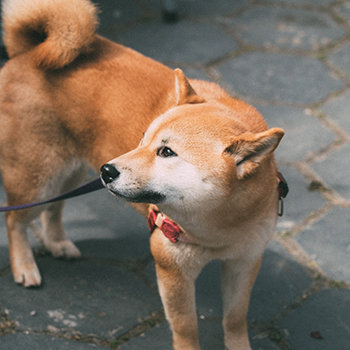<br/>
  imagem original
</p>

<p align="center">
  <br/>
  imagem pos escala de cinza
</p>

Imagem com ruido sal e pimenta com porcentagem de 0,05; 0,1; 0,15; e 0,2.
<p align="center">
  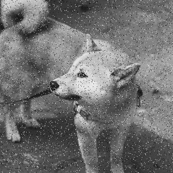
  <br/>
  
  
</p>

##### Testes mediana

Imagem apos filtro de mediana com ordem 3 e ruido sal e pimenta com porcentagem de 0,05; 0,1; 0,15; e 0,2.
<p align="center">
  
  <br/>
  
  
</p>

Imagem apos filtro de mediana com ordem 5 e ruido sal e pimenta com porcentagem de 0,05; 0,1; 0,15; e 0,2.
<p align="center">
  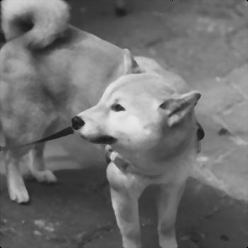
  <br/>
  
  
</p>

##### Testes média

Imagem apos filtro de média com ordem 3 e ruido sal e pimenta com porcentagem de 0,05; 0,1; 0,15; e 0,2.
<p align="center">
  
  <br />
  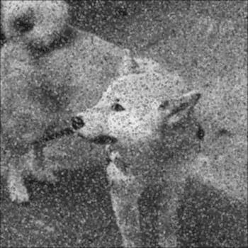
  
</p>

Imagem apos filtro de média com ordem 7 e ruido sal e pimenta com porcentagem de 0,05; 0,1; 0,15; e 0,2.
<p align="center">
  
  <br />
  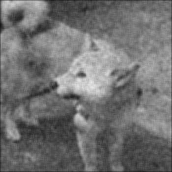
  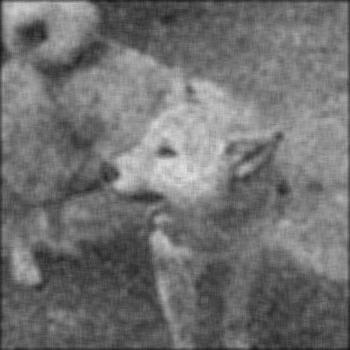
</p>


Imagem apos filtro de média com ordem 15 e ruido sal e pimenta com porcentagem de 0,05; 0,1; 0,15; e 0,2.
<p align="center">
  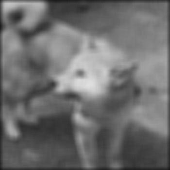
  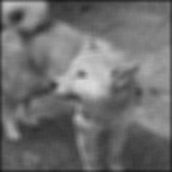<br />
  
  
</p>


Como é possível ver, o filtro de mediana se sai muito a frente do de média para resolver esse problema. Pois o pior cenário que foi da ordem 3 e sal e pimenta de 0,20; ele se sai superior ao melhor cenário da média que é a ordem 3 e sal e pimenta de 0,05.  
Também é possível visualizar o problema de alteração de cores, devido o sal e pimenta pesar muito na média, esse problema é facilmente visualizável nos cenários de ordem 3.


#### Ganho de SNR

##### Ordem 3
Sal & Pimenta   | Média  | Mediana 
------          | ------ | ------ 
0,05            | 19,941 | 29,264
0,10            | 17,372 | 27,464
0,15            | 15,630 | 25,586
0,20            | 15,691 | 25,312

##### Ordem 5
Sal & Pimenta   | Mediana  
------          | ------  
0,05            | 26,013
0,10            | 25,221
0,15            | 24,367
0,20            | 23,293

##### Ordem 7
Sal & Pimenta   | Média  
------          | ------  
0,05            | 20,204
0,10            | 19,189
0,15            | 18,084
0,20            | 17,177

##### Ordem 15
Sal & Pimenta   | Média  
------          | ------  
0,05            | 17,160
0,10            | 16,793
0,15            | 16,376
0,20            | 15,921


### Obtenção de Formas Principais e de Contornos Principais

#### Algoritmo
```m
% -----
% Parte 2
% Formas principais
% -----

pkg load image

"parte 2 iniciada"
imagem_original = imread('./imagem_base.jpg');

imagem_base = double(rgb2gray(imagem_original))/255;

% -----
% Formas Principais
% -----

ordem = 3;

"formas principais"
mascara_media = ones(ordem, ordem);
mascara_media = mascara_media.*(1/(ordem*ordem));

imagem_media = conv2(imagem_base, mascara_media, 'same');
formas_principais = limitarizacao(imagem_media);

% -----
% Contornos Principais
% -----

"contornos principais"
laplaciano = [-1 -1 -1; -1 8 -1; -1 -1 -1];
passa_alta_laplaciano = conv2(formas_principais, laplaciano);
contornos_principais = abs(passa_alta_laplaciano);
```

Aqui para a obtenção das formas principais, reutilizamos o filtro de média da parte 1, onde da mesma maneira é definida uma ordem, em sequência  utilizamos um algoritmo auxiliar para a limiarização da imagem.


```m
function imagem_limiarizada = limitarizacao(imagem_original)
    [largura, altura] = size(imagem_original);

    for linha = 1:altura
        for coluna = 1:largura
            pixel = 0;
            if(imagem_original(linha, coluna) >= 0.5)
                pixel = 1;
            end
            imagem_original(linha, coluna) = pixel;
        end
    end

    "limitarizacao completo"

imagem_limiarizada = imagem_original;
```

De maneira simples, é feito uma iteração na imagem, e caso o pixel tenha valor maior ou igual a 0.5 ele é substituído por 1, caso contrário por 0.

Apos a limiarização a parte de formas principais é concluída e como os primeiros passos dos contornos são os mesmos, reutilizamos os passos que já foram executados.

Então, utilizando a função conv2 do octave, aplicamos um filtro passa alta laplaciano nas formas principais, e por fim transformamos os valores da matriz para valores absolutos, para removermos os números negativos devido a mascara laplaciano.

#### Resultados
##### Formas principais

Formas principais de ordem 3, 7 e 15
<p align="center">
  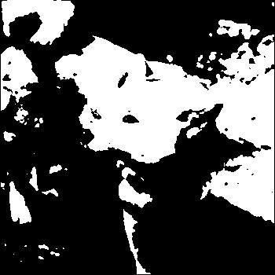
  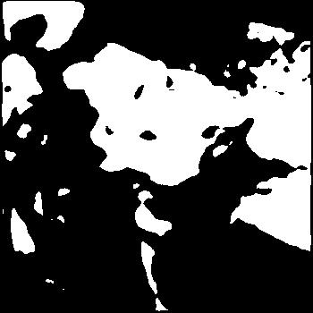<br/>
  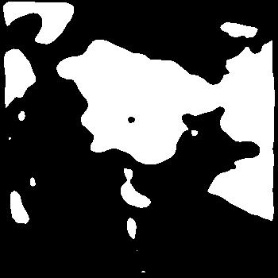
</p>

##### Contornos principais
Formas principais de ordem 3, 7 e 15
<p align="center">
  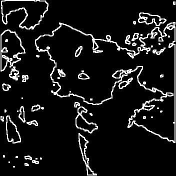
  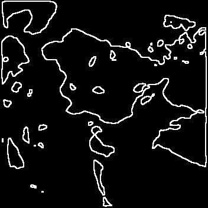<br/>
  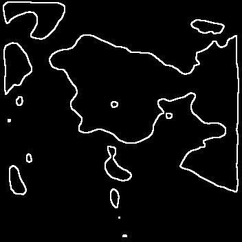
</p>

Nos níveis de ordem 3, ainda é possível ver detalhes, principalmente relacionados ao rosto do cachorro, e aumentar, todos os detalhes se perdem e não é possível determinar qual era a imagem original. 


### Realce de bordas com unsharp masking

#### Algoritmo

```m
% -----
% Parte 3
% Realce de bordas unsharp masking
% -----

pkg load image

"parte 3 iniciada"
imagem_original = imread('./imagem_base.jpg');
imagem_base = double(rgb2gray(imagem_original))/255;

ganho = 1;

ordem = 3;

mascara_media = ones(ordem, ordem);
mascara_media = mascara_media.*(1/(ordem*ordem));

imagem_media = conv2(imagem_base, mascara_media, 'same');

filtragem_passa_baixa = imagem_base.*imagem_media;
bordas = imagem_base - filtragem_passa_baixa;
imagem_unsharp_masking = imagem_base + (ganho * bordas);

```
Para o unsharp masking, seguimos com o filtro de media desenvolvido na primeira parte, e adicionamos uma variavel para o ganho que o unsharp masking irá aplicar. Então é feito os passos do filtro, aplicando o passa baixa, fazendo a multiplicação ponto a ponto das imagens, em seguida feito a diferença para a obtenção das bordas e por fim a soma com a multiplicação das bordas com o ganho.

#### Resultados

Bordas realçadas com ganho de 1 e passa baixa com ordem 3, 7 e 15
<p align="center">
  
  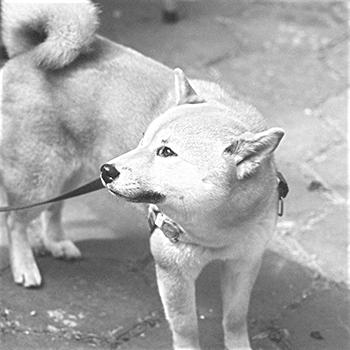<br/>
  
</p>

Bordas realçadas com ganho de 1.2 e passa baixa com ordem 3, 7 e 15
<p align="center">
  
  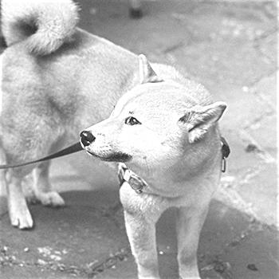<br/>
  
</p>

Bordas realçadas com ganho de 1.5 e passa baixa com ordem 3, 7 e 15
<p align="center">
  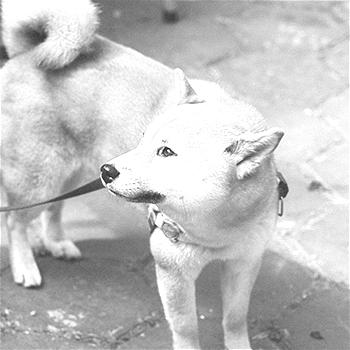
  <br/>
  
</p>

É fácil de visualizar que o filtro unsharp masking, deve-se ter um cuidado, já que com uma pouca quantidade, como ocorre no 1.5, a imagem pode ficar brilho estourado, como ocorre principalmente no rosto do cachorro. Porem também é interessante notar que a combinação do filtro passa baixa de ordem alta, consegue equilibrar e trazer uma maior quantidade de detalhes na imagem, como é possível ver em ordem 15 para os 3 níveis de ganho.


### Conclusões gerais

É impressionante ver esses filtros na prática, em destaque no de mediana, pois imagens que visualmente parecem estar perdidas, voltam a algo muito próximo ao original. E começar a misturar esses filtros pode ser possível trazer ainda uma melhoria maior a essas imagens que possuem algum resquício de ruido. 

### Algoritmos

#### Parte 1

parte1.m
```m
% -----
% Parte 1
% Filtro de media e mediana
% -----

pkg load image

"parte 1 iniciada"
imagem_original = imread('./imagem_base.jpg');

ruido = 0.2;

imagem_base = double(rgb2gray(imagem_original))/255;
imagem_ruidosa = imnoise(imagem_base,  'salt & pepper', ruido);

ordem = 15;

"media"
mascara_media = ones(ordem, ordem);
mascara_media = mascara_media.*(1/(ordem*ordem));

imagem_media = conv2(imagem_ruidosa, mascara_media, 'same');

"mediana"
% imagem_mediana = filtro_mediana(imagem_ruidosa, ordem);

"snr"
snr_conv2 = snr(imagem_base, imagem_media)
% snr_mediana = snr(imagem_base, imagem_mediana)
```

filtro_mediana.m
```m
function nova_imagem = filtro_mediana(imagem, ordem)

    [largura_imagem, altura_imagem] = size(imagem);
    imagem_mediana = zeros(largura_imagem, altura_imagem);

    for linha = 1:altura_imagem
        for coluna = 1:largura_imagem
            sub_matriz_ordem = sub_matriz(imagem, linha, coluna, ordem);
            mediana = median(sub_matriz_ordem(:));
            imagem_mediana(linha, coluna) = mediana;
        end
    end
    "filtro de mediana completo"

nova_imagem = imagem_mediana;
```

sub_matriz.m
```m
function sub = sub_matriz(imagem, linha, coluna, ordem)
    matriz = zeros(ordem, ordem);
    range_vizinho = fix(ordem/2);
    i = 0;
    for linha_i = (linha-range_vizinho):(linha+range_vizinho)
        i++;
        j = 0;
        for coluna_j = (coluna-range_vizinho):(coluna+range_vizinho)
            j++;
            try
                matriz(i,j) = imagem(linha_i,coluna_j);
            catch
            end
        end
    end
sub = matriz;
```

snr.m
```m
function snr_resultado = snr(imagem_perfeita, imagem_ruidosa)
    [largura, altura] = size(imagem_perfeita);

    erro_relativo = 0;
    a = 0;
    b = 0;
    for linha = 1:altura
        for coluna = 1:largura
            a = a + power(imagem_perfeita(linha, coluna) - imagem_ruidosa(linha, coluna), 2);
            b = b + power(imagem_perfeita(linha, coluna), 2);
        end
    end
    erro_relativo = a/b;
    snr_calc = 10 * log10(1/erro_relativo);
    "snr completo"

snr_resultado = snr_calc;
```

#### Parte 2
parte2.m
```m
% -----
% Parte 2
% Formas principais
% -----

pkg load image

"parte 2 iniciada"
imagem_original = imread('./imagem_base.jpg');

imagem_base = double(rgb2gray(imagem_original))/255;

% -----
% Formas Principais
% -----

ordem = 15;

"formas principais"
mascara_media = ones(ordem, ordem);
mascara_media = mascara_media.*(1/(ordem*ordem));

imagem_media = conv2(imagem_base, mascara_media, 'same');
formas_principais = limitarizacao(imagem_media);


% -----
% Contornos Principais
% -----

"contornos principais"
laplaciano = [-1 -1 -1; -1 8 -1; -1 -1 -1];
passa_alta_laplaciano = conv2(formas_principais, laplaciano);
contornos_principais = abs(passa_alta_laplaciano);
```
limitarizacao.m
```m
function imagem_limiarizada = limitarizacao(imagem_original)
    [largura, altura] = size(imagem_original);

    for linha = 1:altura
        for coluna = 1:largura
            pixel = 0;
            if(imagem_original(linha, coluna) >= 0.5)
                pixel = 1;
            end
            imagem_original(linha, coluna) = pixel;
        end
    end

    "limitarizacao completo"

imagem_limiarizada = imagem_original;

```

#### Parte 3
parte3.m
```m
% -----
% Parte 3
% Realce de bordas unsharp masking
% -----

pkg load image

"parte 3 iniciada"
imagem_original = imread('./imagem_base.jpg');
imagem_base = double(rgb2gray(imagem_original))/255;

ganho = 1.5;

ordem = 15;

mascara_media = ones(ordem, ordem);
mascara_media = mascara_media.*(1/(ordem*ordem));

imagem_media = conv2(imagem_base, mascara_media, 'same');

filtragem_passa_baixa = imagem_base.*imagem_media;
bordas = imagem_base - filtragem_passa_baixa;
imagem_unsharp_masking = imagem_base + (ganho * bordas);

```
