# ATIVIDADE PRÁTICA nº 02

#### Wesley Adriann - 1822130040

## Histograma
O histograma é um gráfico para quantificarmos a distribuição de brilho de uma imagem. Com ele podemos analisar e diferenciar se uma tem concentração de pixels escuros (baixo nível de brilho), médios, altos (alto nível de brilho) ou se a imagem possui uma distribuição uniforme (possuindo um contraste maior).


### Equalização de histograma

Para a equalização utilizaremos a fórmula

<p align="center">
  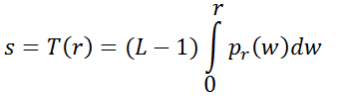
</p>

Então iniciamos gerando o histograma de uma imagem inicial e seu histograma

<p align="center">
  
</p>

<p align="center">
  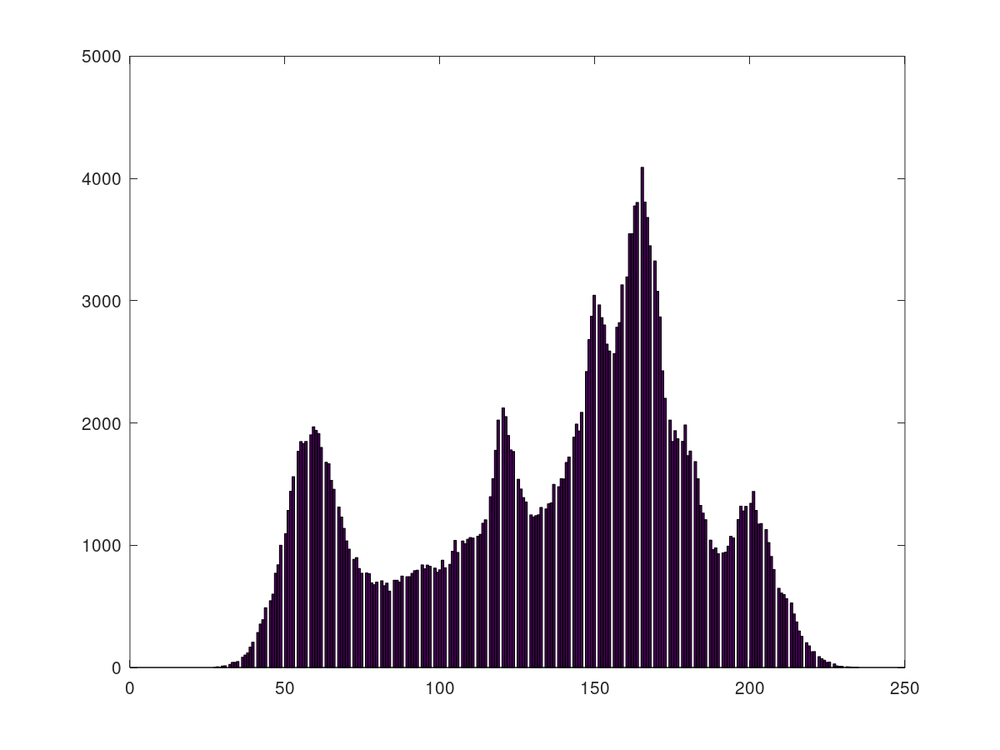
</p>

E variações da imagem original com variações de brilho.
<p align="center">
  
  
  
</p>

<p align="center">
  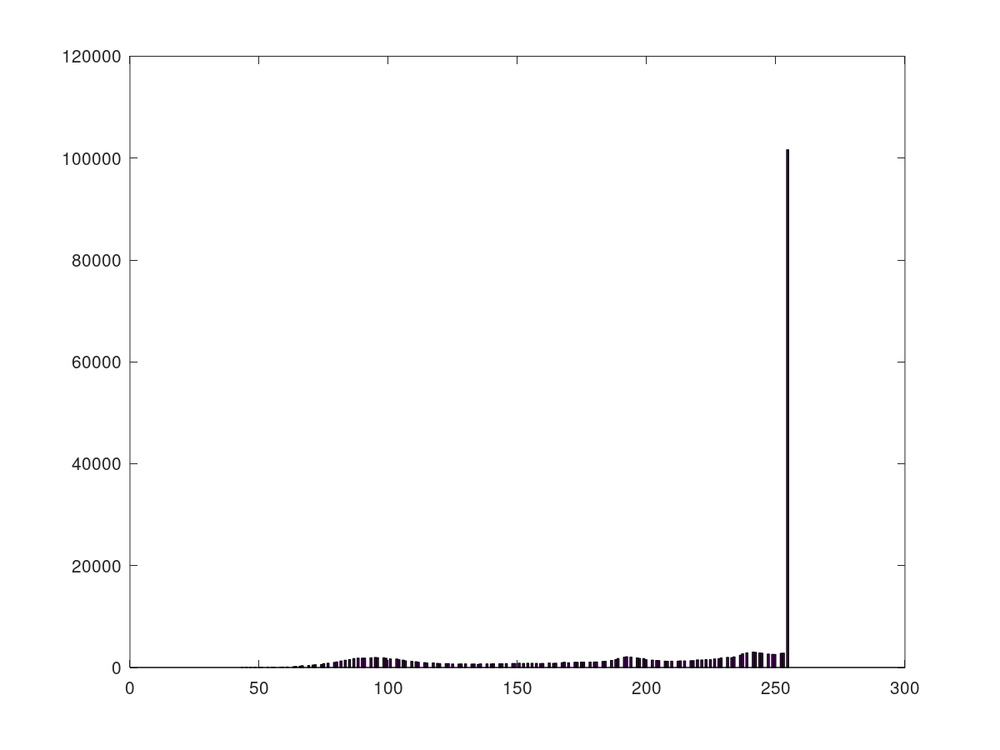
  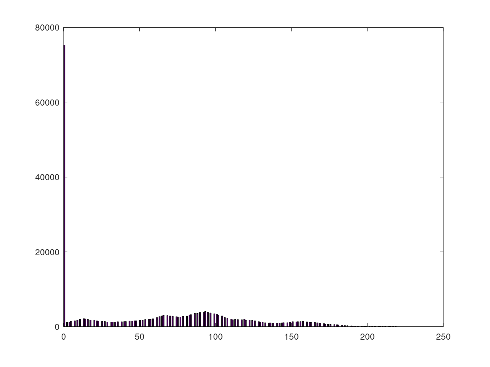
  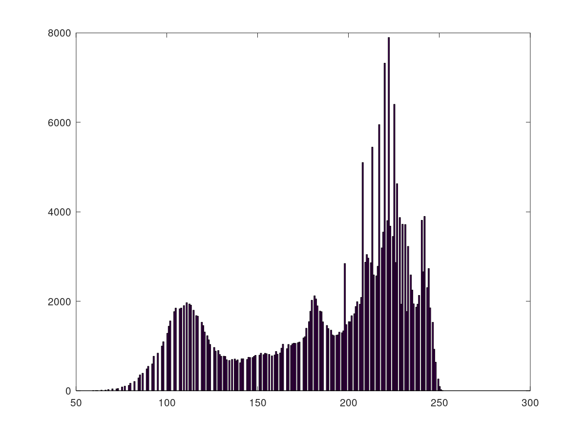
</p>

Para o processo, por padrão transformamos a imagem em escala de cinza para quantificar cada pixel, em uma lista. Com isso temos a quantidade quantos pixels de cada tonalidade a imagem possui.
```
histograma = zeros(1, niveis);
for linha = 1:altura
  for coluna = 1:largura
      pixel = nova_imagem(linha,coluna) + 1;
      histograma(1, pixel) += 1;
  end
end
```
Nesse ponto na leitura da cor do pixel, é importante tomar cuidado, já que um pixel totalmente preto, irá causar um erro no matlab/octave, ja que lista e matrizes começam pelo índice 1.


Apos isso fazemos o somatório em uma segunda lista para aplicar a fórmula acima

```
histograma_equalizado = zeros(1, niveis);
tamanho = altura * largura
for a = 1:niveis
    histograma_equalizado(1, a) = (histograma(1, a)/tamanho);
    if(a != 1)
        histograma_equalizado(1, a) += histograma_equalizado(1, a-1);
    endif
end
```

Assim, podemos passar novamente por cada pixel e retribuindo o valor de cada um, utilizando o índice da segunda lista multiplicado pela quantidade de bits (8 bits = 2^8 = 256).

```
for linha = 1:altura
    for coluna = 1:largura
        pixel = nova_imagem(linha,coluna) + 1;
        nova_imagem(linha,coluna) = niveis * histograma_equalizado(1, pixel)
    end
end
```

Então o resultado para as mesmas imagens que tiveram o brilho alterado

<p align="center">
  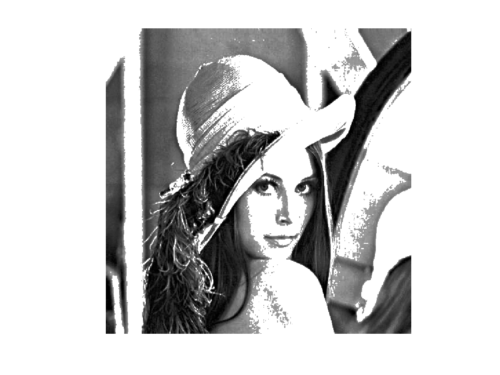
  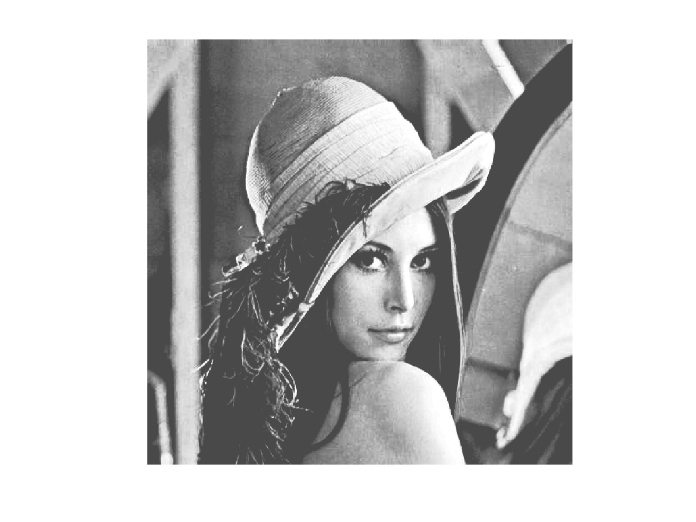
  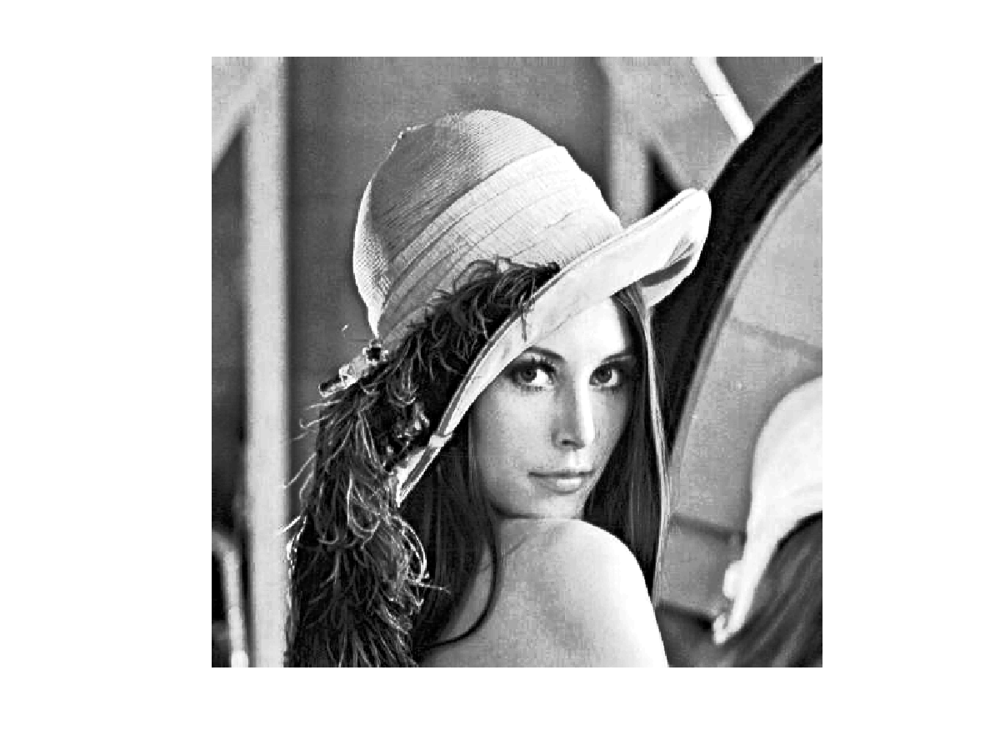
</p>

<p align="center">
  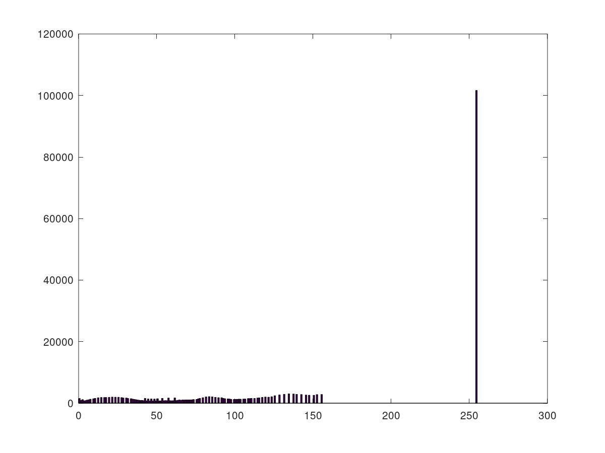
  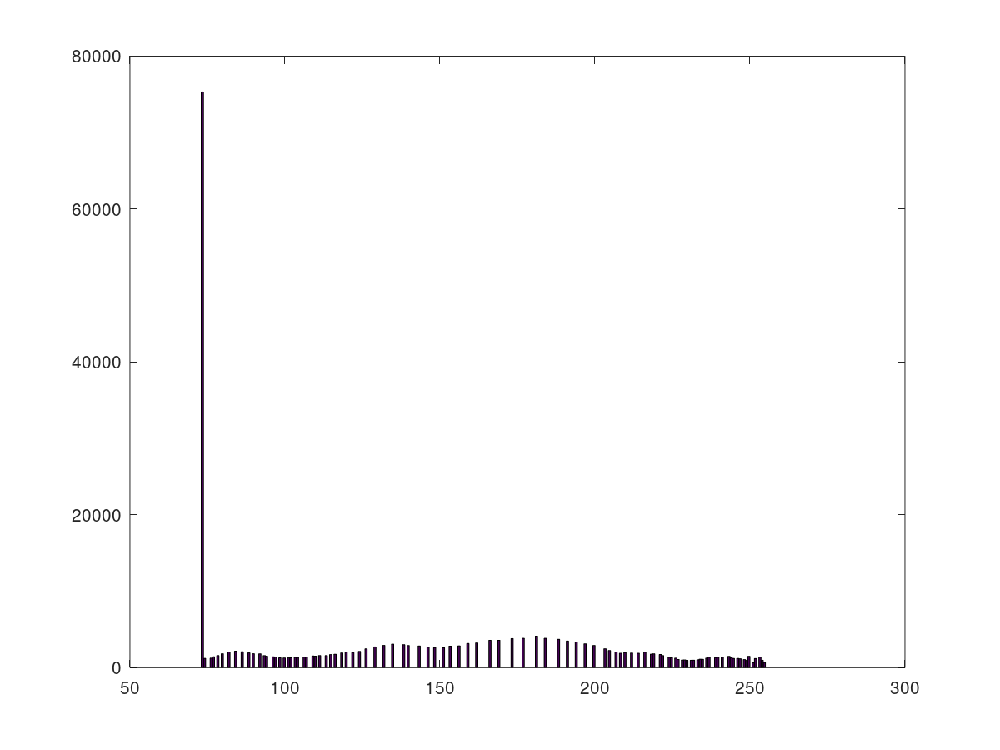
  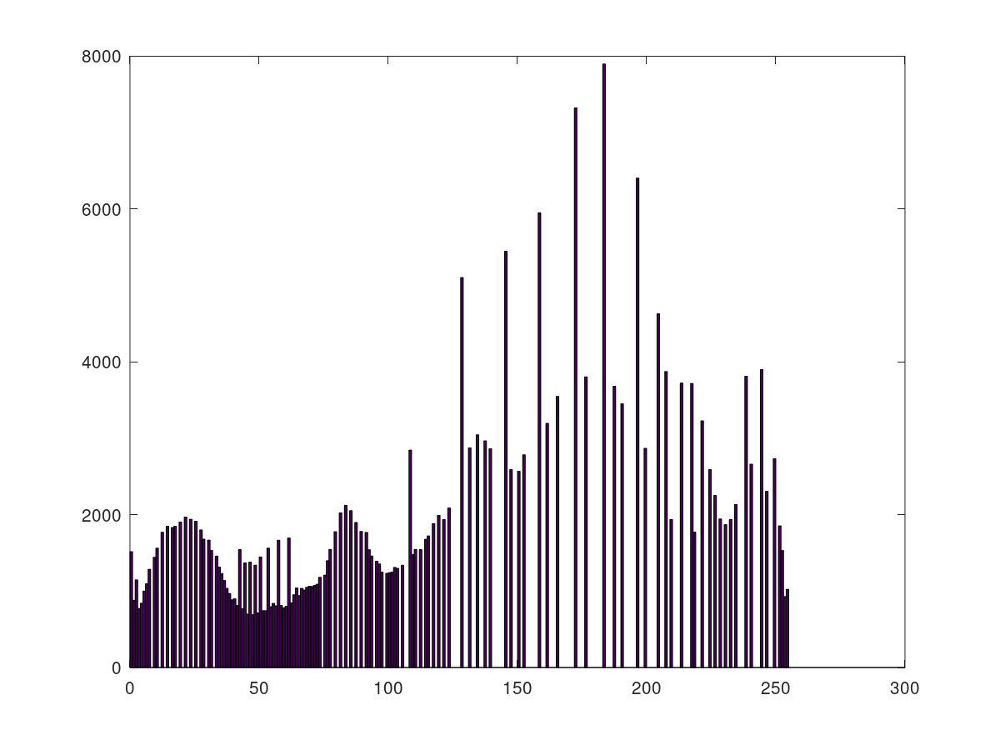
</p>

Nas duas primeiras imagens, o gráfico continua distorcido devido a grande quantidade de pixels da cor branca e preta, porem na imagem nota-se a diferença, e na terceira é nítido os contornos mais fortes devido o aumento de contraste.

#### Algoritmo
```
function novo_hist = equializa_histograma(imagem)
    nova_imagem = rgb2gray(imagem);
    niveis = 255

    [altura, largura, profundidade] = size(nova_imagem);
    histograma = zeros(1, niveis + 1);
    for linha = 1:altura
        for coluna = 1:largura
            pixel = nova_imagem(linha,coluna) + 1;
            pixel
            histograma(1, pixel) += 1;
        end
    end

    histograma_equalizado = zeros(1, niveis);
    tamanho = altura * largura
    for a = 1:niveis
        histograma_equalizado(1, a) = (histograma(1, a)/tamanho);
        if(a != 1)
            histograma_equalizado(1, a) += histograma_equalizado(1, a-1);
        endif
    end

    for linha = 1:altura
        for coluna = 1:largura
            pixel = nova_imagem(linha,coluna) + 1;
            nova_imagem(linha,coluna) = niveis * histograma_equalizado(1, pixel);
        end
    end

    imshow(nova_imagem);
    figure(2);
    hist(nova_imagem(:), 255);
    "end equializa_histograma"

novo_hist = nova_imagem;
```
