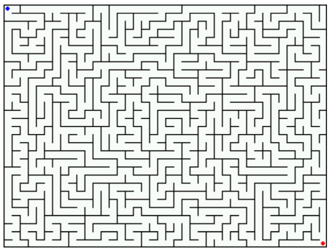
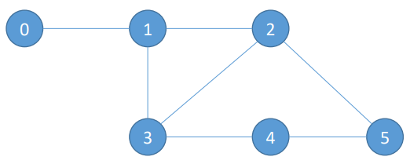

# Projeto 01

## Proposta

### Resolvendo problemas com Grafos

#### Labirinto...



#### O Projeto

- Você foi capturado por uma horda de Morlocks.
- Eles adoram fazer jogos com suas vítimas!
- Desta vez, eles resolveram soltar você em um dos seus labirintos subterrâneos.
- Você só será liberado para voltar para sua casa se você responder a uma simples questão:
- **Quantos caminhos** existem para sair do labirinto e** qual o menor** entre eles ?

#### A Entrada

- O algoritmo deve tratar um arquivo de entrada (labirinto.txt) que contém dados no seguinte padrão

```
6
0
0,1
1,2
1,3
2,3
2,5
3,4
4,5
```

- A 1ª linha indica a quantidade de vértices (6);
- A 2ª linha indica o vértice onde você inicia (0);
- A 3ª linha indica qual o vértice final (5);
- O restante indicam as adjacências, separado por “,” (vírgula).



### Saída esperada

```
Qtd. de caminhos possíveis: 4
Melhor caminho: 0, 1, 2, 5
Peso 3
```

### Considerações

- Caminhos não repetem vértices;
- Trabalho **individual**;
- **Deve ser tratada** a entrada do **arquivo** especificado;
  - Outras entradas são utilizadas.
- Apresentação no laboratório (17/09);
- O trabalho deve ser enviado para o Blackboard;
- **Ausência** da **apresentação ou submissão** do trabalho implica na **redução de 50% da nota**.


## Rodando

#### Docker (recomendado)

```bash
docker build . -t <container_tag>
docker run -it <container_tag> sh
python3 projeto01.py
```
<container_tag> é o nome que o container terá  

#### Python
```bash
python3 projeto01.py
```