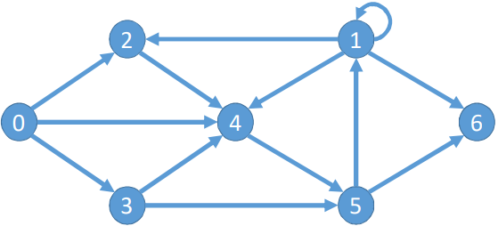

## Exercicio 05
#### [Algoritmo](../algoritmos/exercicio05.py)

- Dado um vértice inicial como parâmetro, implementar um algoritmo que realiza o cálculo da distância entre os vértices de um grafo;
- Usar a implementação do BFS como base da implementação
- Apresentar a distâncias entre os vértices do grafo direcionado abaixo:

